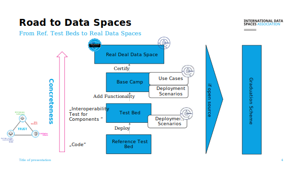
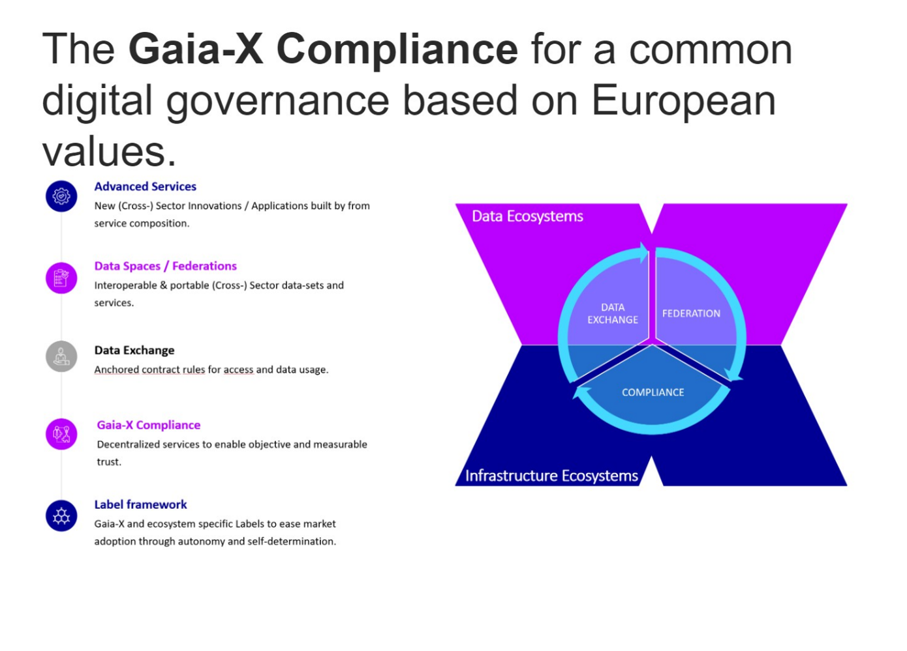
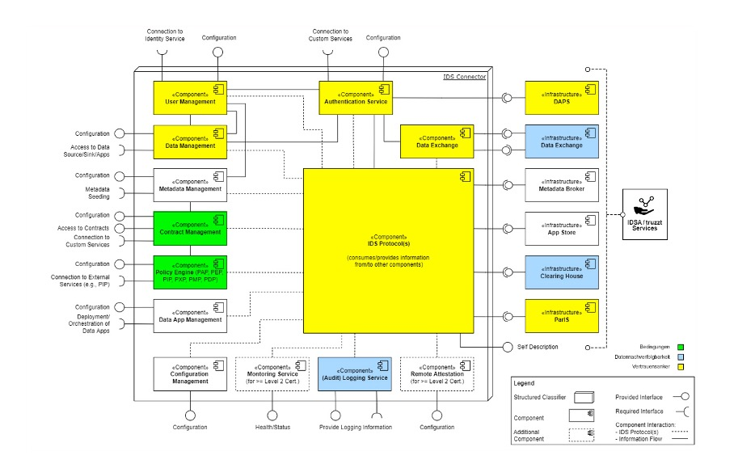
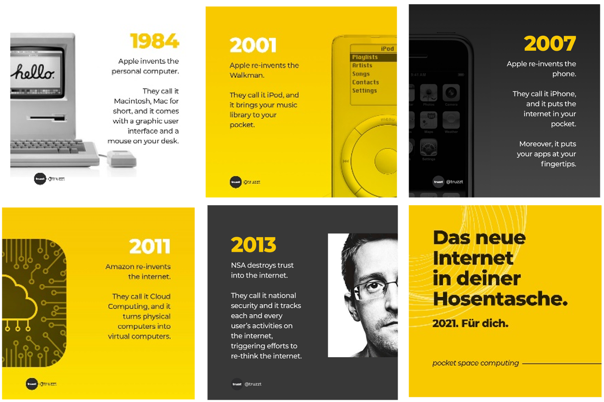
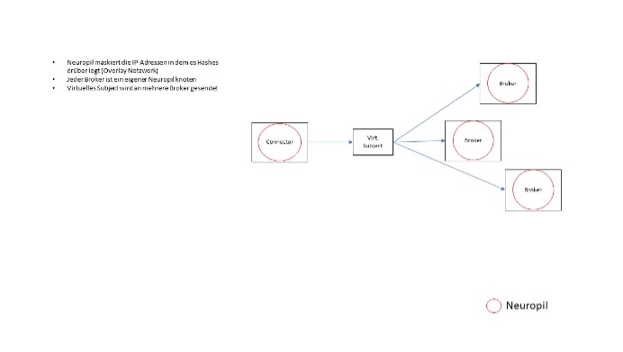
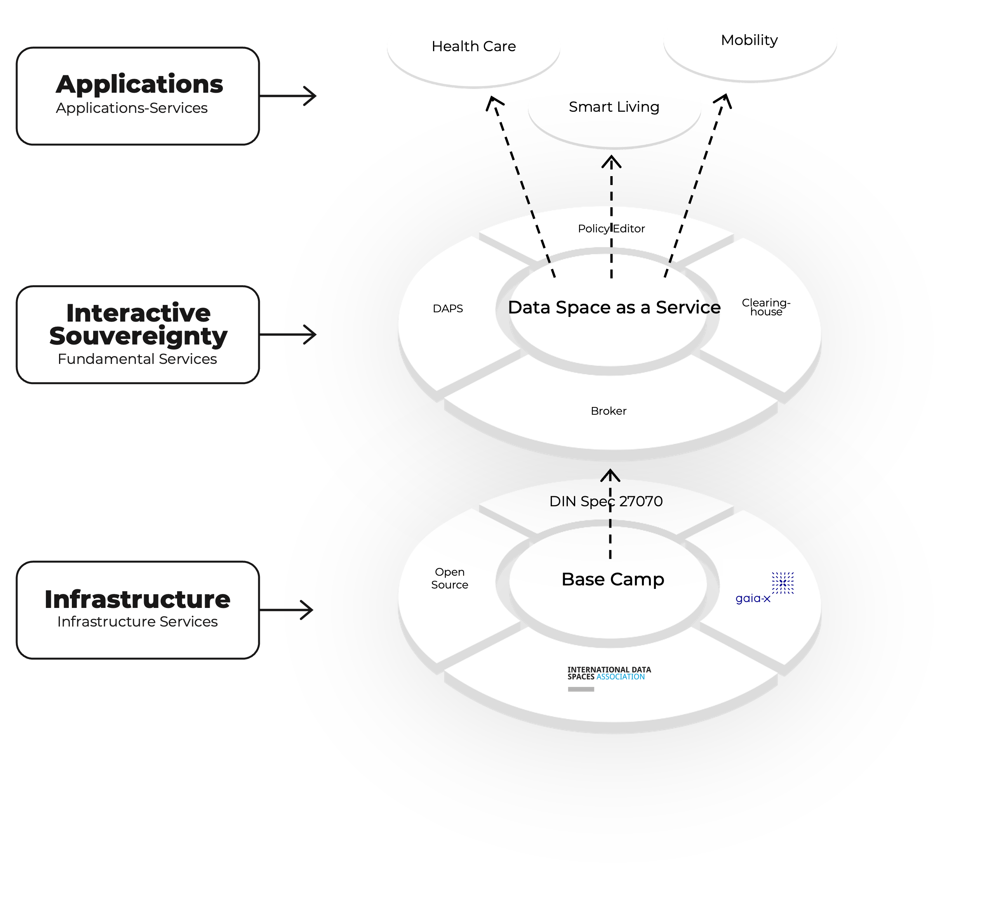
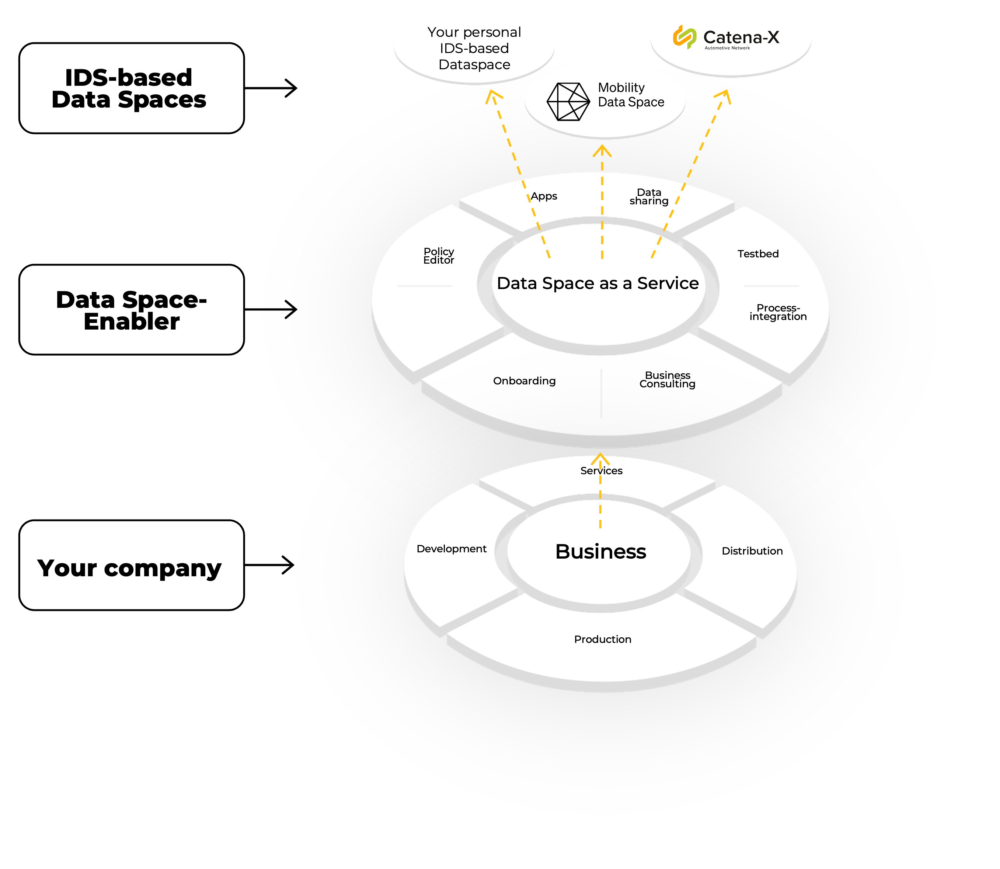

**Mission for Launch Coalition 2022**

_ **Let's build a base camp for data spaces** _

Data Spaces built according to the IDSA specifications are growing in numbers and complexity. The Basecamp initiative is working towards the creation of an integrated and tested set of OSS components which can be used in pilot as well as in productive environments, leveraging the experience and from contributions of projects in all stages of the lifecycle.

The goal is to enable developers, testbeds and productive systems to be able to work on a common basis and leverage the power of many to constantly improve the code set whilst maintaining the highest level of interoperability. At the same time the efforts of project teams can shift from setup and integration of basic services towards the value of creating use cases.

The basecamp is maintained by the IDSA to ensure its alignment with the IDSA reference architecture and specifications; V 1.0 of the basecamp consists of the following IDS based infrastructure components: CA, DAPS, ParIS, Metadata Broker, Transaction Log (Clearing House). V2.0 will add App Store and Vocabulary Provider.

**What does the Base Camp offer?**

The basecamp will use OSS, which has been accepted by commercial operators after validation towards security, scalability and maintainability requirements and is used in productive environments. It does not contain any proprietary elements and is available to all parties which are willing to contribute.

It is open to be extended with additional components and services (like onboarding workflows, integration with ID or certificate providers, testbeds, different type of connectors).

**Genesis: Project Launch Coalition II Base Camp**

- Mission Statement:

- Set-up an open source V1 for all IDS based infrastructure components to enable external stakeholder to set up data spaces on a reliable base

- Team: Klaus Ottradovetz, Rainer Sträter, Hannes Bauer
- Supporter: André Nemat, Lars Nagel, Sebastian Steinbuss, Christoph Mertens
- Start: August 15, 2022

- End: January/Feb, 2023

Approach

- intensive research with the community on available software assets
- improvement of the code base towards a production grade technical readiness level

- packaging towards an integrated distribution

**Changelog**

| Version | Date | Description | Editor |
| --- | --- | --- | --- |
| 1.0 | 2022-09-15 | Base Camp Part | Christoph Mertens |
| 1.0 | 2022-11-18 | Description International Standard for Data Sovereignty | Robin Bauer |
| 1.1 | 2022-11-20 | Adding Neuropil Informations | Robin Bauer |
| 2.0 | 2023-03.15 | New Graphics for Dataspaces as Ecosystems | Robin Bauer |

# **Inhalt**

[1.International standard to ensure data sovereignty, traceability and anchors of trust on the Internet. 5](#_Toc120026346)

[1.1 Basics for understanding the implementation of the IDSA standard: 5](#_Toc120026347)

[1.2. An example: Fake shops: 5](#_Toc120026348)

[2. Rudiments: 6](#_Toc120026349)

[2.1. How to do it without restricting ecosystems? 6](#_Toc120026350)

[2.2. How is the problem of trust in road traffic regulated internationally?? 6](#_Toc120026351)

[2.2.1. With laws, rules and standards! 6](#_Toc120026352)

[2.3.How to solve the trust problem in a data ecosystem? 7](#_Toc120026353)

[3. The IDSA-Standard: 7](#_Toc120026354)

[4. What does an architecture look like that guarantees data sovereignty with free data trading?: 8](#_Toc120026355)

[5. Why is the IDSA standard possible today? 9](#_Toc120026356)

[6. Core technologies used for implementation 10](#_Toc120026357)

[7. Short description Structure: Neuropil for Connectors, DAPS and Broker: 10](#_Toc120026358)

[8. Brief description of Open Source Intel® SGX Technology 12](#_Toc120026359)

[9. Basis for IDSA-based data rooms: 12](#_Toc120026360)

[10. Data rooms as data ecosystems using IDSA Connectors and Essential Services: 13](#_Toc120026361)

[Additional Information: 14](#_Toc120026362)

[W3C Verified Credentials 14](#_Toc120026363)

# 1.International standard to ensure data sovereignty, traceability and anchors of trust on the Internet.

**Apart from technical buzzwords and structures, this document should focus on what should be made possible in theory:**

Data sovereignty, traceability and anchors of trust.

## **1.1**  **Basics for understanding the implementation of the IDSA**** Standard ****:**

Would you feel safe on public roads at home or abroad without traffic signs and license plates?

This is exactly what is happening on the Internet.

Similar to traffic regulations and access conditions for road traffic, we also need a standard on the Internet on which we can build mutual trust. With **data sovereignty** and **traceability** , we can achieve this. By allowing all users to use the Internet under the same conditions and understand what happens to their own data, we create a starting point that everyone can refer to.

We provide an **anchor of trust** that enables safe and equal cooperation with minimal risk. As with license plates, users remain anonymous to others, but can be identified if necessary. Retailers and buyers benefit from mutual traceability and fake news can also be effectively traced and combated.

## **1.2.** Fake shops as an example:

Buyers don't trust retailers and retailers don't trust buyers. Shopping on the Internet offers certain risks for both. For potential buyers it is important: Will I get my goods? Are the goods genuine and undamaged?

Retailers, on the other hand, have to ask themselves: Will I get my money? Will I be cheated out of the purchase amount afterwards? Both sides have legitimate reasons to be cautious, perhaps even suspicious, of the other.

These problems are not new, but well-known and just need to be adapted to today's times and technologies. Proposals for solutions must solve the problems and meet today's requirements.

# 2. Rudiments:

## 2.1. How to do it without restricting ecosystems?

Establishing secure communication between two known parties is technically easy to implement. If you want to use data ecosystems, you need more. You need an overarching, secure standard that takes into account many complex things and is modularly expandable.

The data ecosystem is not only the communication between data providers and data consumers, but a complete ecosystem that must run securely and according to certain laws, rules and ethical principles. Laws protect those who cannot protect themselves.

An example of a solution in such a complex ecosystem is road traffic: it is not enough to build roads and cars to get from A to B, but rules and laws must be complied with, so that traffic can run safely. Cars have certain construction requirements and traffic is regulated by laws.

## 2.2. How is the problem of trust in road transport regulated internationally?

### 2.2.1. With laws, rules and standards!

- Manufacturers may only sell cars with certification and ECE homologation
- The course and numbering of European routes, including motorways, is determined by ECE.
- Car owners head to the local traffic office with their vehicle registration, insurance and identity card.
- License plate is issued and must be attached to the car in the prescribed place.
- Car owners are entitled to drive with this license plate but must always carry a valid driver's license and a vehicle registration document.
- Of course, there are always participants who do not comply with law, but there are the police, monitoring all traffic and intervening if necessary.
- Only the police are able to check driving rights, license plates and car papers.

## 2.3. How to solve the trust problem in a data ecosystem?

**With laws, rules and standards! Described here with the IDSA standard****.**

**From highway to data highway****.**

- An IDSA connector must comply with certain building codes in order to obtain a valid certificate.
- An IDSA connector requires registration (onboarding) regulated by DAPS, PaRIS and identity providers. Here the verified identity is connected to a certified connector and you get another certificate (ID). This ID can be assigned by all authorized data rooms.
- With a valid certificate (ID), the connector is authorized to participate in the ecosystem, exchange or purchase data.

# 3. The IDSA-Standard:

- The abbreviation stands for "International Data Spaces Association", which is the author of said standard. Simply put, this is an architectural regulation that guarantees the authenticity of customers and merchants including secure data transmission based on "clean room" connectors through secure and verified identities.
- This way you can always be sure that your counterpart is the person they claim to be. At the same time, data traceability ensures buyer and dealer protection.

- Core components are the **IDSA Connector** and the so-called " **Essential Services**":

- The **Dynamic Attribute Provisioning System** or " **DAPS"** ensures the identity of all participants. This system confirms the authenticity of individuals by verifying the certificates created during the process with the help of other services (ParIS, identity management).
- In order for the connectors to find each other, the **broker** is needed **.** This mediates both partners and ensures a correct assignment. It is also possible to search for specific data via the broker or to offer your own.
- In order to be able to reliably trace the transactions made, there is the **clearing house:** using encrypted, non-forgeable protocols, it records the data transfers between traders and buyers. In addition, terms of use of transmitted data are also stored.
- Last but not least, the **App Store** is a service that allows connector owners to run certified programs in their connector. In the App Store, for example, certified personal assistants can be downloaded, which have been specially created for this purpose.

# 4. What does an architecture look like that guarantees data sovereignty with free data trading:

A decentralized, distributed system for the respective functions and services is also a technical prerequisite for the IDSA services themselves. Similar to the DNS (Domain Name Service), e.g., the DAPS should be able to be operated by anyone, but the function must not be manipulable. This allows companies the greatest possible independence, also in the pricing of the use of the services. Likewise, DNS is essential for the functioning of the Internet, but no one pays directly for this service.

Further prerequisites for this are the implementation of data **sovereignty, data traceability and anchors of trust**.

**Data sovereignty:** allows completely self-determined control over the collection, storage, use and processing of one's own data.

**Data traceability** : as a data provider, you want to make sure that you can determine who can do what with your own data in a data space, and under what conditions. You want to have transparency about what actually happens to shared data.

**Anchor of trust** : You also want to be able to trust that the person is really who he claims to be. (Figure 1). This requires an anchor of trust and secure **digital identities**.

Figure 1: schematic representation – implementation of data sovereignty with IDSA components

_Figure 1._

# 5. Why is the IDSA standard possible today?

**2022 truzzt**

Machines and containers are the basic prerequisite for IDSA-based dataspaces.

  

# 6. Core technologies used in the implementation

Neuropil

Intel SGX

Keycloak

W3C (verified credentials)

Kubernetes

…

# 7. Short description of Neuropil for Connectors, DAPS and Broker:

Neuropil is an overlay network (a logical network) that is built on top of an existing physical network (Internet). A separate address space with its own addressing, as well as with the use of its own path selection methods is used (independent of the underlay). Neuropil is used to build an additional logical topology for the distribution of essential services, which are therefore decentralized. In addition, Neuropil results in a resource-saving and effective structure, which enables fast communication on IoT devices. In this logical network, the physical network addresses of nodes are mapped to randomly selected virtual addresses. This virtual address space is large enough that most of it is never used, and address collisions are virtually impossible. The Neuropil protocol is aligned by the architecture according to IDS.

**Explanation**** :**
**Functionality of the Broker**

- virtual subject Neuropil (self-description can be sent or not) supports only a limited message size

1. DAT Subject: Dynamic Attribute Token (DAPS Token abfragen)

# 8. Brief description of Open Source Intel® SGX Technology

For application and solution developers, new hardware-based controls for cloud and enterprise environments provide excellent opportunities to ensure high data security. Intel® Software Guard Extensions (Intel® SGX)1 2 provide hardware-based encryption of memory contents that isolates specific program code and data in memory. With Intel® SGX, application code can consume its own areas of memory, known as enclaves, that are protected from processes running at a higher privilege level. Only Intel® SGX offers this level of control and protection. ([https://www.intel.de/content/www/de/de/architecture-and-technology/software-guard-extensions.html](https://www.intel.de/content/www/de/de/architecture-and-technology/software-guard-extensions.html)).

Intel® SGX helps protect against many known and active threats. They form an additional layer of defense by helping to reduce the attack surface of the system.

The combination of Intel® SGX's enhanced security and verification capabilities, along with Intel's continued collaboration with a broad ecosystem of security companies, helps minimize the potential attack surface and even reduce theoretical risks.

# 9. The basis for IDSA-based data rooms:

A virtual machine/container with IDSA Connector (Data Space) as a Service and Essential Services to ensure data sovereignty, traceability and anchors of trust.

# 10. Data rooms as data ecosystems using IDSA Connectors and Essential Services:

# Additional Information:

## W3C Verified Credentials

**In the physical world**  **Identification takes place** through sensory perception (optical, haptic, acoustic, olfactory, gustatory) and related cognitive processes, such as comparison with existing knowledge. Limited or missing senses or knowledge makes it difficult to act in the physical world. A fake ID, the mimicry of an insect or even the pictorial optical illusion, there are hurdles in the clear identification. In addition, an entity often has different identities, roles, states that it occupies and about which it may reveal only parts of itself or is willing to reveal. However, the interaction of the senses and the involvement of external knowledge helps in the progressive interaction with the entity to identify it for what it actually is.

**In virtual worlds** representation and identification of an entity takes place via zeros and ones. Sensors are merely an uncertain bridge to physical reality. In this sense, on a digital basis, the processes and concepts of digital identities – including ensuring truthfulness, management and governance, as well as their applicability and variability of use – are of fundamental importance. The approaches differ depending on what identities are needed and created for, depending on industry or company and the type of entity, whether it is machines, components, products, people, patents, software or websites.
